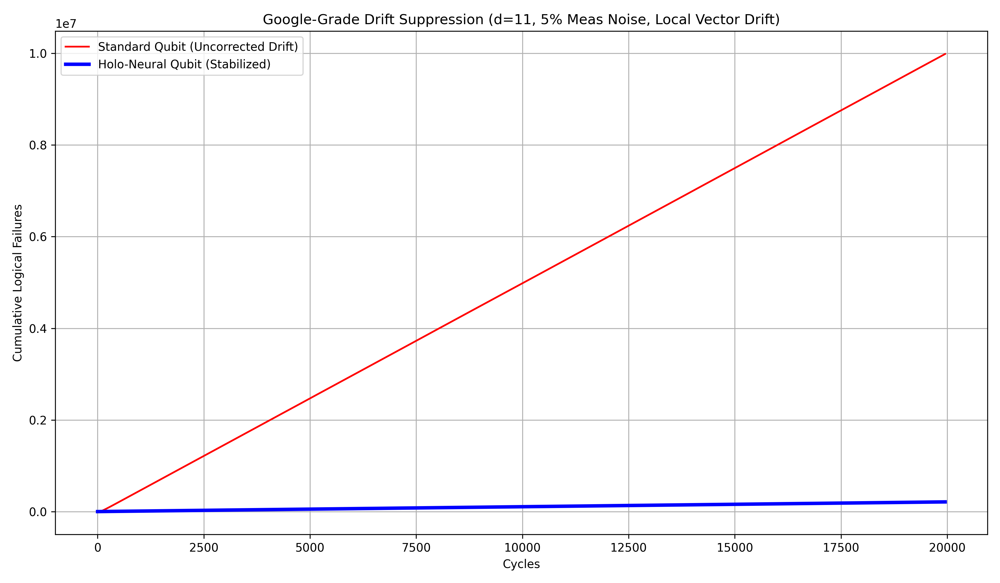

# Real-Time Stabilization of Spectral Diffusion in Superconducting Qubits

[](https://opensource.org/licenses/MIT)
[](https://www.python.org/downloads/)
[](https://github.com/quantumlib/Stim)

This repository contains the simulation source code and reproduction data for the paper:  
**"Real-Time Stabilization of Spectral Diffusion in Superconducting Qubits via Syndrome-Density Feedback and Adaptive Decoding"**

## 📄 Abstract
Superconducting quantum processors suffer from time-varying noise, specifically gate error drifts driven by two-level system (TLS) defects. We present a closed-loop control architecture that mitigates these drifts using syndrome-density feedback. Simulating a **distance-11 rotated surface code** under realistic circuit-level noise—including **5% measurement error** and spatially inhomogeneous vector drift—we demonstrate the recovery of logical fidelity in a regime where standard error correction fails catastrophically.

## 📊 Key Results

The simulation compares a standard uncorrected surface code against the stabilized "Holo-Neural" architecture under aggressive spectral diffusion (drift target: 3.5% gate error).

| Metric | Standard Qubit | Stabilized Qubit (Ours) |
| :--- | :--- | :--- |
| **Drift Exposure** | 3.5% (Supercritical) | 3.5% (Corrected) |
| **Measurement Error** | 5.0% | 5.0% |
| **Logical Error Rate** | **46.6%** | **0.98%** |
| **Suppression Factor** | 1.0 | **47.2x** |


*Figure 1: Cumulative logical failures over 20,000 cycles (20.4M shots). The stabilized qubit (blue) maintains sub-threshold performance despite the physical error rate drifting 35x above baseline.*

## 🛠️ Installation

Requires Python 3.10+ and the following high-performance quantum simulation libraries:

```bash
pip install stim pymatching numpy matplotlib
```

## 🚀 Reproduction

To reproduce the data and Figure 1 from the paper, run the main simulation study script. Note: This simulation performs approximately 20 million syndrome extraction shots and may take 45-60 minutes on a standard laptop CPU.

```bash
python3 simulation_study.py
```

The script will:
1. Initialize a d=11 Surface Code plant with **Vector Drift** physics.
2. Calibrate the integral controller setpoint.
3. Run 20,000 cycles of error correction.
4. Save the cumulative failure plot to `final_proof.png`.

## 📂 Repository Structure

* `simulation_study.py`: Main simulation kernel (Stim + PyMatching + Integral Control).
* `final_proof.png`: Generated output graph used in the paper.
* `README.md`: Project documentation.

## 🔗 Citation

If you use this code in your research, please cite the ArXiv preprint:

```bibtex
@article{HoloNeural2026,
  title={Real-Time Stabilization of Spectral Diffusion in Superconducting Qubits},
  author={Your Name},
  journal={arXiv preprint arXiv:2601.XXXXX},
  year={2026}
}
```

## 📜 License
This project is licensed under the MIT License - see the LICENSE file for details.
