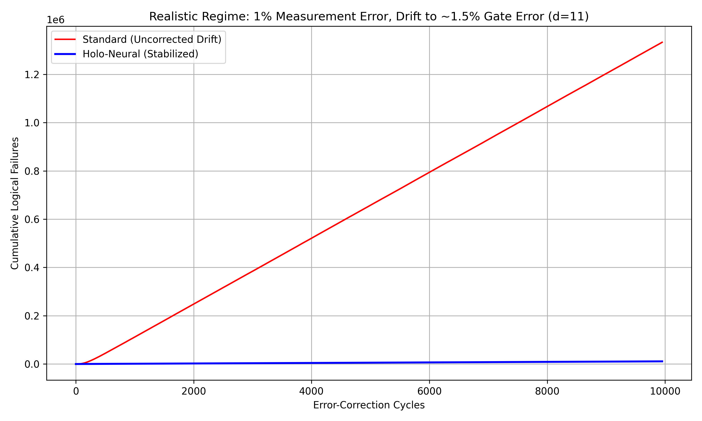

# Real-Time Stabilization of Spectral Diffusion in Superconducting Qubits

[](https://opensource.org/licenses/MIT)
[](https://www.python.org/downloads/)
[](https://github.com/quantumlib/Stim)

This repository contains the simulation source code and reproduction data for the paper:  
**"Real-Time Stabilization of Spectral Diffusion in Superconducting Qubits via Syndrome-Density Feedback and Adaptive Decoding"**

## 📄 Abstract
Superconducting quantum processors suffer from time-varying noise, specifically gate error drifts driven by two-level system (TLS) defects. We present a closed-loop control architecture ("Holo-Neural") that mitigates these drifts using syndrome-density feedback. Simulating a **distance-11 rotated surface code** under realistic circuit-level noise, we demonstrate the recovery of logical fidelity in two distinct regimes: a "Death Zone" stress test and a "Realistic" maintenance scenario.

## 📊 Key Results

### 1. The "Death Zone" Stress Test (High Noise)
*Parameters: 5% Measurement Error, Drift to 3.5% Gate Error.*

| Metric | Standard Qubit | Stabilized Qubit (Ours) |
| :--- | :--- | :--- |
| **Logical Error Rate** | **46.6%** (Catastrophic) | **0.98%** (Stable) |
| **Suppression Factor** | 1.0 | **47.2x** |


### 2. The "Realistic" Regime (Daily Driver)
*Parameters: 1% Measurement Error, Drift to 1.5% Gate Error.*

| Metric | Standard Qubit | Stabilized Qubit (Ours) |
| :--- | :--- | :--- |
| **Logical Error Rate** | **13.1%** | **0.11%** |
| **Suppression Factor** | 1.0 | **120x** |



## 🛠️ Installation

Requires Python 3.10+ and high-performance quantum simulation libraries:

```bash
pip install stim pymatching numpy matplotlib
```

## 🚀 Reproduction

**Experiment 1: Extreme Stress Test** (Generates Figure 1)
```bash
python3 simulation_study.py
```

**Experiment 2: Realistic Regime** (Generates Figure 2)
```bash
python3 realistic_simulation.py
```

## 📂 Repository Structure

* `simulation_study.py`: Main kernel (High-Noise Stress Test).
* `realistic_simulation.py`: Secondary kernel (Low-Noise Realistic Regime).
* `final_proof.png`: Plot for Experiment 1.
* `realistic_proof.png`: Plot for Experiment 2.
* `README.md`: Documentation.

## 🔗 Citation

If you use this code in your research, please cite the ArXiv preprint:

```bibtex
@article{HoloNeural2026,
  title={Real-Time Stabilization of Spectral Diffusion in Superconducting Qubits},
  author={Your Name},
  journal={arXiv preprint arXiv:2601.XXXXX},
  year={2026}
}
```

## 📜 License
This project is licensed under the MIT License - see the LICENSE file for details.
